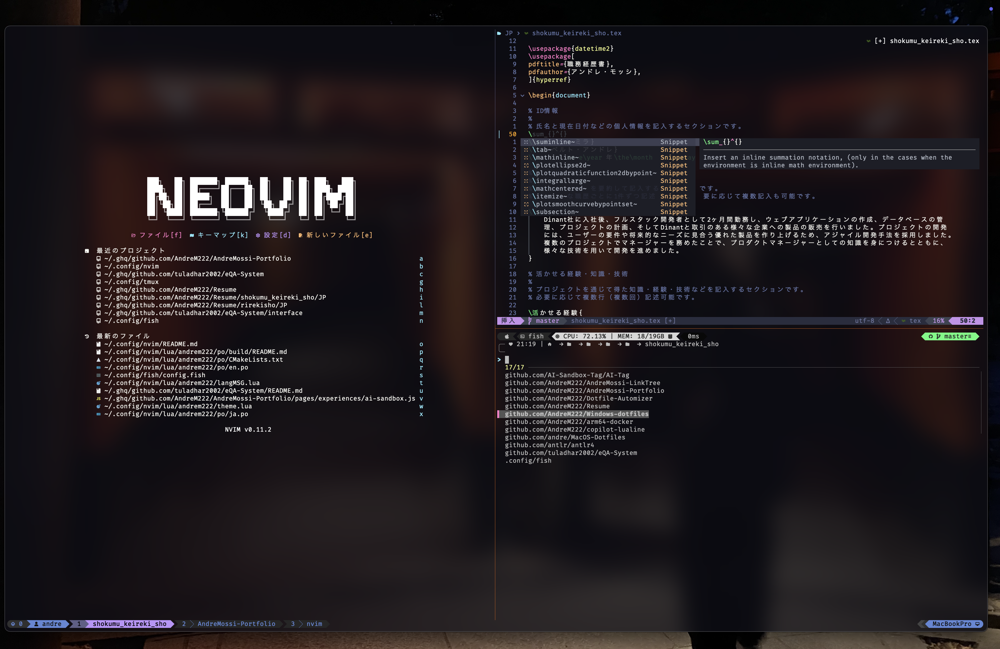
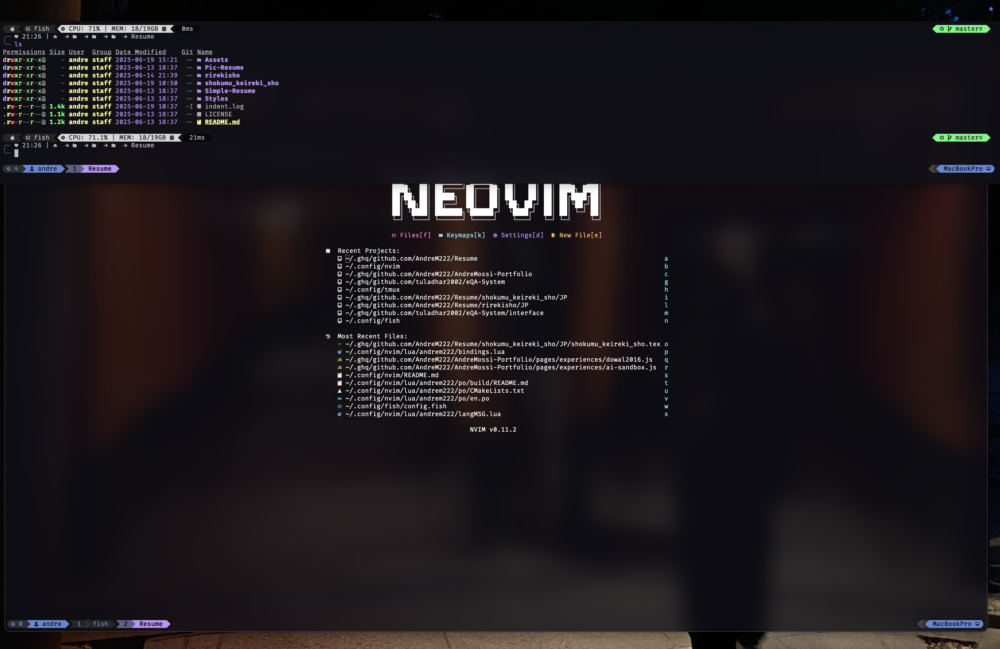

# MacOS Dotfiles

> [!WARNING]
> The fish-shell configuration has Japanese language set since I am studying the language
> And Ghostty doesnt yet support localization. You can remove the line as marked if you want.
> The Neovim setup I have is the only Neovim setup that supports translations. By default goes to
> English, but if a translation for your language is available, then it will translate it.

<p align='center'>





</p>

## Contents 📦

- Git Configuration

- MacOS Terminal Configuration

- TMux Configuration

- Linked Dotfiles

## Navigation ✈️

[Switch To Windows-Dotfiles <-](https://github.com/AndreM222/Windows-Dotfiles) (For Detailed Setup)

- [Navigate To Ghostty Dotfiles <-](https://github.com/AndreM222/ghostty) (For Detailed Setup)

- [Navigate To Neovim Dotfiles <-](https://github.com/AndreM222/nvim) (For Detailed Setup)

- [Navigate To Fish-Shell Dotfiles <-](https://github.com/AndreM222/fish) (For Detailed Setup)

- [Navigate To TMux Dotfiles <-](https://github.com/AndreM222/tmux) (For Detailed Setup)

## Dependencies 📃

- Git >= 2.19.0 (for partial clones support)

- Nerd Fonts >= 3.0

## Ghostty Terminal 🖥️

```
--- TMux ---
(ctrl - s) - Prefix Key
(Prefix + g) - Lazygit
(Prefix + `) - Lazydocker
(choose-tree + c) - Create new session in choose-tree
(choose-tree + r) - Initiate rename while in choose-tree
(Prefix + [h,j,k,l]) - Move between panes
(Prefix + ctrl - [h,j,k,l]) - Resize panes
(Prefix + ctrl - shift - arrow[left,right]) - Move between panes
```

```
--- Ghostty ---
(ctrl - shift - p) - Open Quick Terminal
```

```
--- Fish-Shell ---
(ctrl - g) - Ghq Jumper
(ctrl - d) - Forward Delete
```

## Font 🖌️

- [FiraCode-NF-Mono](https://www.nerdfonts.com/font-downloads) - Font

## Theme 🎭

- [Dracula](https://draculatheme.com/windows-terminal) - Dracula Color Theme

## Terminal 📟

- [Ghostty](https://ghostty.org/) - Terminal

## Shell 🛡️

- [Fish-Shell](https://fishshell.com/) - Shell

## Setup ⚒️

##### Package Managers 📦

- [Brew](https://github.com/coreybutler/nvm-windows) - <span style="opacity:30%">brew</span>
```
/bin/bash -c "$(curl -fssl https://raw.githubusercontent.com/homebrew/install/head/install.sh)"
```

- [nvm | nodejs](https://github.com/nvm-sh/nvm) - <span style="opacity:30%">npm</span>
```
brew install nvm
```

- [Fisher](https://github.com/jorgebucaran/fisher) - <span style="opacity:30%">fisher</span>
```
curl -sL https://raw.githubusercontent.com/jorgebucaran/fisher/main/functions/fisher.fish | source && fisher install jorgebucaran/fisher
```

##### Brew - Needs Installation

- [Git](https://git-scm.com/download/win) - `brew install git`

## Directory Structure 🗂️

```
📂~/.config/ghostty
|__📄config

📂~/.config/fish
|__📄config.fish

📂~/.config/git
|__📄config

📂~/.config/lazygit
|__📄config.yml

📂 $HOME/AppData/Local/Nvim
|__📂lua/andrem222
|   |__📂 po
|   |   |__📑 All Translations Files
|   |__📂 pluginDev
|   |   |__📑 All Personal Plugin Installation and Setup Files
|   |__📂 plugins
|   |   |__📑 All Plugin Installation and Setup Files
|   |__📄bindings.lua
|   |__📄config.lua
|   |__📄debug.lua
|   |__📄devconfig.lua
|   |__📄langMSG.lua
|   |__📄lazy.lua
|   |__📄theme.lua
|__📄init.lua

📂~/.config/tmux
|__📂components
|   |__📄hostStatus.sh
|__📄macos.conf
|__📄statusline.conf
|__📄tmux.conf
|__📄utility.conf
```
